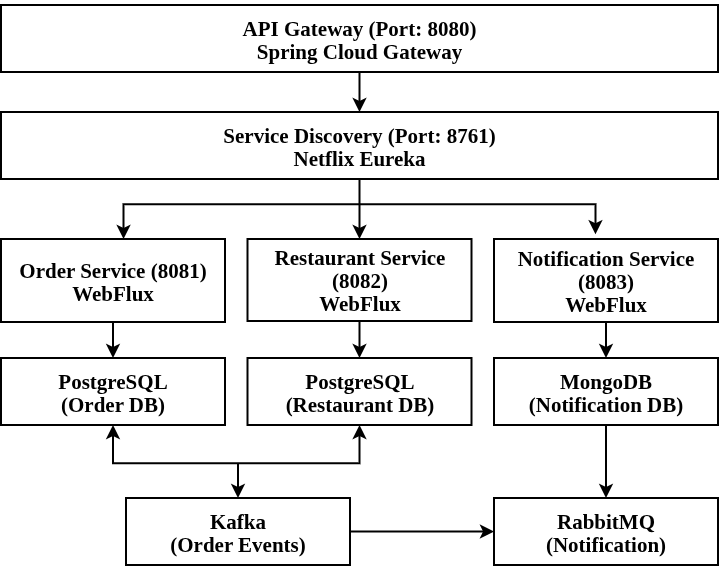

# 🍕 Food Delivery Management System

## Cloud-Native Reactive Microservices Application

---

### 📌 Course Information
- **Course:** Software Service Engineering (YN3012180059)
- **Institution:** Yunnan University, School of Software and AI
- **Semester:** Spring 2026
- **Teacher:** Ahmed Zahir
- **Assignment:** Final Project
- **Topic:** Option B - Food Delivery Management System

---

### 👨‍💻 Student Information
- **Name:** Tuhin Md Abu Hamza
- **Student ID:** 20233120013
- **Major:** Software Engineering

---

## 🏗️ Architecture




---

## 🛠️ Technology Stack

| Component | Technology |
|-----------|------------|
| Framework | Spring Boot 3.2.5 |
| Reactive | Spring WebFlux |
| Service Discovery | Netflix Eureka |
| API Gateway | Spring Cloud Gateway |
| Database (SQL) | PostgreSQL 16 |
| Database (NoSQL) | MongoDB 7 |
| Reactive SQL | Spring Data R2DBC |
| Object Mapping | MapStruct 1.5.5 |
| Messaging | Apache Kafka, RabbitMQ |
| API Documentation | SpringDoc OpenAPI 2.5.0 |
| Security | JWT + Spring Security |
| Resilience | Resilience4j |
| Tracing | Zipkin + Micrometer |
| Build Tool | Gradle 8.5 |
| Containerization | Docker + Docker Compose |
| Java Version | 17 / 21 |


---

## 🔌 API Endpoints

### Order Service (`/api/orders`)

| Method | Endpoint | Description |
|--------|----------|-------------|
| POST | `/` | Create new order |
| GET | `/{id}` | Get order by ID |
| GET | `/user/{userId}` | Get orders by user (with pagination) |
| GET | `/restaurant/{restaurantId}` | Get orders by restaurant |
| PUT | `/{id}/status` | Update order status |
| DELETE | `/{id}` | Cancel order |
| GET | `/count/{status}` | Get order count by status |

**Request Body (POST):**
```json
{
  "userId": "user123",
  "restaurantId": "f681ba2d-3cb4-455b-a3ca-8675cb8347d2",
  "items": "[{\"name\":\"Margherita Pizza\",\"quantity\":2,\"price\":12.99}]",
  "totalAmount": 25.98,
  "deliveryAddress": "456 Elm Street, Dhaka"
}
Restaurant Service (/api/restaurants)
Method	Endpoint	Description
POST	/	Create restaurant
GET	/{id}	Get restaurant by ID
GET	/?page=0&size=10	Get all restaurants (pagination)
GET	/cuisine/{cuisineType}	Get restaurants by cuisine
GET	/active	Get active restaurants
GET	/top?limit=10	Get top rated restaurants
GET	/search?name=Pizza	Search restaurants by name
PUT	/{id}	Update restaurant
DELETE	/{id}	Delete restaurant (soft delete)
PUT	/{id}/rating?rating=4.5	Update restaurant rating
Request Body (POST):

{
  "name": "Pizza Palace",
  "description": "Best Italian Pizza",
  "address": "123 Food Street, Dhaka",
  "phone": "+880123456789",
  "email": "info@pizzapalace.com",
  "cuisineType": "Italian",
  "operatingHours": "10AM-10PM",
  "deliveryFee": 2.99,
  "minimumOrderAmount": 10.00,
  "isActive": true,
  "isAcceptingOrders": true
}


Menu Item Service (/api/menu-items)
Method	Endpoint	Description
POST	/	Add menu item
GET	/restaurant/{restaurantId}	Get menu items by restaurant
GET	/restaurant/{restaurantId}/available	Get available menu items
GET	/restaurant/{restaurantId}/category/{category}	Get menu items by category
GET	/restaurant/{restaurantId}/price-range?min=10&max=50	Get menu items by price range
GET	/restaurant/{restaurantId}/vegetarian	Get vegetarian menu items
PUT	/{id}	Update menu item
DELETE	/{id}	Delete menu item
PATCH	/{id}/toggle-availability	Toggle availability
Request Body (POST):

{
  "restaurantId": "f681ba2d-3cb4-455b-a3ca-8675cb8347d2",
  "name": "Margherita Pizza",
  "description": "Classic pizza with tomato and mozzarella",
  "price": 12.99,
  "category": "Main Course",
  "isAvailable": true,
  "isVegetarian": true,
  "isVegan": false,
  "isGlutenFree": false,
  "preparationTime": 15
}


Notification Service (/api/notifications)
Method	Endpoint	Description
POST	/	Create notification
GET	/{id}	Get notification by ID
GET	/user/{userId}	Get notifications by user
GET	/order/{orderId}	Get notifications by order
GET	/pending	Get pending notifications
PUT	/{id}/status	Update notification status
Request Body (POST):


{
  "userId": "user123",
  "orderId": "c50bd6e8-ff03-48f0-98c4-f0ded862acca",
  "type": "EMAIL",
  "subject": "Order Created",
  "message": "Your order has been created successfully!",
  "recipient": "user@example.com",
  "priority": "HIGH"
}


🚀 Quick Start
Prerequisites
Java 17 or 21

Docker & Docker Compose

Gradle 8.5+

1. Start Docker Containers
bash
cd ~/Documents/Spring\ 2026/Software\ Service\ Engineering/Final/food-delivery-system

# Start all databases and message brokers
docker run -d --name postgres-order -e POSTGRES_DB=order_db -e POSTGRES_USER=postgres -e POSTGRES_PASSWORD=postgres -p 5432:5432 postgres:16

docker run -d --name postgres-restaurant -e POSTGRES_DB=restaurant_db -e POSTGRES_USER=postgres -e POSTGRES_PASSWORD=postgres -p 5433:5432 postgres:16

docker run -d --name mongodb -e MONGO_INITDB_ROOT_USERNAME=admin -e MONGO_INITDB_ROOT_PASSWORD=admin123 -e MONGO_INITDB_DATABASE=notification_db -p 27017:27017 mongo:7

docker run -d --name zookeeper -p 2181:2181 zookeeper:3.8

docker run -d --name kafka -p 9092:9092 -e KAFKA_ZOOKEEPER_CONNECT=172.17.0.1:2181 -e KAFKA_ADVERTISED_LISTENERS=PLAINTEXT://localhost:9092 -e KAFKA_OFFSETS_TOPIC_REPLICATION_FACTOR=1 -e KAFKA_BROKER_ID=1 confluentinc/cp-kafka:7.0.0

docker run -d --name rabbitmq -p 5672:5672 -p 15672:15672 -e RABBITMQ_DEFAULT_USER=admin -e RABBITMQ_DEFAULT_PASS=admin123 rabbitmq:3-management

docker run -d --name zipkin -p 9411:9411 -e STORAGE_TYPE=mem openzipkin/zipkin:latest
2. Check Containers
bash
docker ps
3. Create Database Tables
bash
# Order Service Table
docker exec -it postgres-order psql -U postgres -d order_db -c "
CREATE TABLE IF NOT EXISTS orders (
    id UUID PRIMARY KEY DEFAULT gen_random_uuid(),
    user_id VARCHAR(50) NOT NULL,
    restaurant_id UUID NOT NULL,
    items TEXT NOT NULL,
    total_amount DECIMAL(10,2) NOT NULL,
    status VARCHAR(20) NOT NULL DEFAULT 'PENDING',
    delivery_address TEXT NOT NULL,
    created_at TIMESTAMP DEFAULT CURRENT_TIMESTAMP,
    updated_at TIMESTAMP DEFAULT CURRENT_TIMESTAMP
);"

# Restaurant Service Tables
docker exec -it postgres-restaurant psql -U postgres -d restaurant_db -c "
CREATE TABLE IF NOT EXISTS restaurants (
    id UUID PRIMARY KEY DEFAULT gen_random_uuid(),
    name VARCHAR(100) NOT NULL,
    description TEXT,
    address TEXT NOT NULL,
    phone VARCHAR(20) NOT NULL,
    email VARCHAR(100),
    cuisine_type VARCHAR(50) NOT NULL,
    rating DECIMAL(3,2) DEFAULT 0.00,
    total_reviews INTEGER DEFAULT 0,
    operating_hours TEXT,
    delivery_fee DECIMAL(5,2) DEFAULT 0.00,
    minimum_order_amount DECIMAL(10,2) DEFAULT 0.00,
    is_active BOOLEAN DEFAULT TRUE,
    is_accepting_orders BOOLEAN DEFAULT TRUE,
    created_at TIMESTAMP DEFAULT CURRENT_TIMESTAMP,
    updated_at TIMESTAMP DEFAULT CURRENT_TIMESTAMP
);"

docker exec -it postgres-restaurant psql -U postgres -d restaurant_db -c "
CREATE TABLE IF NOT EXISTS menu_items (
    id UUID PRIMARY KEY DEFAULT gen_random_uuid(),
    restaurant_id UUID NOT NULL REFERENCES restaurants(id) ON DELETE CASCADE,
    name VARCHAR(100) NOT NULL,
    description TEXT,
    price DECIMAL(10,2) NOT NULL,
    category VARCHAR(50) NOT NULL,
    is_available BOOLEAN DEFAULT TRUE,
    is_vegetarian BOOLEAN DEFAULT FALSE,
    is_vegan BOOLEAN DEFAULT FALSE,
    is_gluten_free BOOLEAN DEFAULT FALSE,
    preparation_time INTEGER DEFAULT 15,
    image_url VARCHAR(255),
    created_at TIMESTAMP DEFAULT CURRENT_TIMESTAMP,
    updated_at TIMESTAMP DEFAULT CURRENT_TIMESTAMP
);"


4. Start Services (5 Terminals)
bash
# Terminal 1: Service Discovery
./gradlew :service-discovery:bootRun

# Terminal 2: API Gateway
./gradlew :api-gateway:bootRun

# Terminal 3: Order Service
./gradlew :order-service:bootRun

# Terminal 4: Restaurant Service
./gradlew :restaurant-service:bootRun

# Terminal 5: Notification Service
./gradlew :notification-service:bootRun
5. Test the System
bash
# 1. Create Restaurant
curl -X POST http://localhost:8082/api/restaurants \
  -H "Content-Type: application/json" \
  -d '{"name":"Pizza Palace","description":"Best Italian Pizza","address":"123 Food Street, Dhaka","phone":"+880123456789","email":"info@pizzapalace.com","cuisineType":"Italian","operatingHours":"10AM-10PM","deliveryFee":2.99,"minimumOrderAmount":10.00,"isActive":true,"isAcceptingOrders":true}'

# 2. Add Menu Item (Use Restaurant ID from response)
curl -X POST http://localhost:8082/api/menu-items \
  -H "Content-Type: application/json" \
  -d '{"restaurantId":"YOUR_RESTAURANT_ID","name":"Margherita Pizza","description":"Classic pizza","price":12.99,"category":"Main Course","isAvailable":true}'

# 3. Create Order
curl -X POST http://localhost:8081/api/orders \
  -H "Content-Type: application/json" \
  -d '{"userId":"user123","restaurantId":"YOUR_RESTAURANT_ID","items":"[{\"name\":\"Margherita Pizza\",\"quantity\":2,\"price\":12.99}]","totalAmount":25.98,"deliveryAddress":"456 Elm Street, Dhaka"}'
📚 API Documentation
Service	Swagger UI URL
Order Service	http://localhost:8081/swagger-ui.html
Restaurant Service	http://localhost:8082/swagger-ui.html
Notification Service	http://localhost:8083/swagger-ui.html
🧪 Testing
Unit Tests
bash
# All Tests
./gradlew test

# Order Service Tests (6 tests)
./gradlew :order-service:test

# Restaurant Service Tests (11 tests)
./gradlew :restaurant-service:test

# Notification Service Tests (9 tests)
./gradlew :notification-service:test
Test Results
text
✅ Total Tests: 26
✅ Passed: 26
✅ Failed: 0
🐳 Docker Commands
Command	Description
docker compose up -d	Start all services
docker compose ps	Check container status
docker compose logs	View all logs
docker compose logs [service]	View specific service logs
docker compose down	Stop all services
⭐ Features
Feature	Status
✅ Microservices Architecture (3 services)	✅
✅ Reactive Programming (WebFlux)	✅
✅ Service Discovery (Eureka)	✅
✅ API Gateway	✅
✅ RESTful API Design	✅
✅ Database per Service	✅
✅ SQL + NoSQL Databases	✅
✅ MapStruct DTO Mapping	✅
✅ OpenAPI/Swagger Documentation	✅
✅ Apache Kafka Integration	✅
✅ RabbitMQ Integration	✅
✅ Docker Containerization	✅
✅ Unit Tests (26 tests)	✅
✅ JWT Security (Bonus)	✅
✅ Resilience4j (Bonus)	✅
✅ Zipkin Tracing (Bonus)	✅
✅ Centralized Configuration (Bonus)	✅
📊 Development Progress
Step	Description	Status
1	Project Structure + Docker Setup	✅
2	Order Service (Spring WebFlux + PostgreSQL + Kafka)	✅
3	Restaurant Service (Spring WebFlux + PostgreSQL)	✅
4	Notification Service (Spring WebFlux + MongoDB + Kafka + RabbitMQ)	✅
5	Service Discovery (Eureka)	✅
6	API Gateway	✅
7	MapStruct Mapper	✅
8	Swagger/OpenAPI	✅
9	Unit Tests (26 tests)	✅
10	JWT Security (Bonus)	✅
11	Resilience4j (Bonus)	✅
12	Zipkin Tracing (Bonus)	✅
13	Docker Compose	✅
14	Demo Ready	✅
🔗 Important URLs
Service	URL
Eureka Dashboard	http://localhost:8761
API Gateway	http://localhost:8080
Order Service Swagger	http://localhost:8081/swagger-ui.html
Restaurant Service Swagger	http://localhost:8082/swagger-ui.html
Notification Service Swagger	http://localhost:8083/swagger-ui.html
RabbitMQ Dashboard	http://localhost:15672 (admin/admin123)
Zipkin Dashboard	http://localhost:9411
📝 License
This project is submitted as a final assignment for Software Service Engineering (YN3012180059) at Yunnan University, School of Software and AI.

👨‍💻 Author
Name: Tuhin Md Abu Hamza

Student ID: 20233120013

University: Yunnan University

Course: Software Service Engineering (YN3012180059)

Semester: Spring 2026

Teacher: Ahmed Zahir
